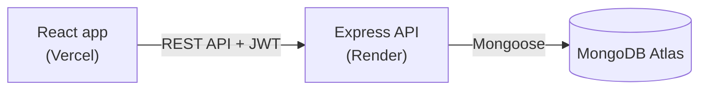

# JOTDOWN

A full-stack notes app where each user gets a private space to write, organize and find their notes. Built with MongoDB, Express, React and Node.

**Live demo:** https://jotdown-shubham.vercel.app

> The backend runs on Render's free plan and sleeps after 15 minutes without traffic. The first request after that can take up to a minute while it wakes up.

## Features

- Sign up and log in with JWT authentication; passwords are hashed with bcrypt
- Create, edit and delete notes, with rich-text editing (bold, italic, lists, links) using Quill
- Pin important notes to the top and mark favorites
- Add tags to notes and click a tag to filter by it
- Search across note titles and content
- Soft delete: deleted notes go to Trash and can be restored
- Every note request is scoped to the logged-in user, so nobody can read or edit someone else's notes
- Note HTML is sanitized with DOMPurify before rendering to prevent XSS

## Tech stack

| Layer | Tools |
|---|---|
| Frontend | React 19, Vite, React Router, Tailwind CSS, custom CSS, React Quill, Axios |
| Backend | Node.js, Express 5, Mongoose, JSON Web Tokens, bcrypt |
| Database | MongoDB Atlas |
| Hosting | Vercel (frontend), Render (backend) |

## How it fits together



The React app stores the JWT after login and sends it in the `Authorization` header. A `protect` middleware on the backend verifies the token and attaches the user to the request before any note route runs.

## API

| Method | Route | Description |
|---|---|---|
| POST | `/api/auth/register` | Create an account, returns `{ user, token }` |
| POST | `/api/auth/login` | Log in, returns `{ user, token }` |
| GET | `/api/users/me` | Current user (protected) |
| GET | `/api/notes` | Active notes, pinned first (protected) |
| GET | `/api/notes/trash` | Deleted notes (protected) |
| POST | `/api/notes` | Create a note (protected) |
| PUT | `/api/notes/:id` | Update title, content, tags, pin, favorite or restore (protected) |
| DELETE | `/api/notes/:id` | Move a note to Trash (protected) |

## Project structure

```
jotdown/
├── backend/
│   ├── server.js            # loads env, connects DB, starts server
│   └── src/
│       ├── app.js           # Express app, CORS, routes
│       ├── config/          # MongoDB connection
│       ├── controllers/     # auth, user and note logic
│       ├── middleware/      # JWT protect, error handler
│       ├── models/          # User and Note schemas
│       └── routes/
└── frontend/
    └── src/
        ├── components/      # auth UI, note composer, protected route
        ├── context/         # AuthContext (global login state)
        ├── pages/           # Login, Register, Dashboard
        ├── services/        # API calls
        └── utils/
```

## Running locally

You need Node.js 22 and a MongoDB connection string (local or Atlas).

**Backend**

```bash
cd backend
npm install
cp .env.example .env    # then fill in MONGO_URI and JWT_SECRET
npm start               # runs on http://localhost:5000
```

**Frontend** (in a second terminal)

```bash
cd frontend
npm install
cp .env.example .env    # VITE_API_URL=http://localhost:5000/api
npm run dev             # runs on http://localhost:5173
```

## What I'd improve next

- Reminders and notifications for notes
- Keep the backend warm or show a "waking up" message during cold starts
- Move the JWT from localStorage to an httpOnly cookie
- Rich-text editing when creating a note, not only when editing
- Rate limiting on the login route
- Tests for the API

## Author

Shubham Indulkar · [GitHub](https://github.com/Shubham-cde)